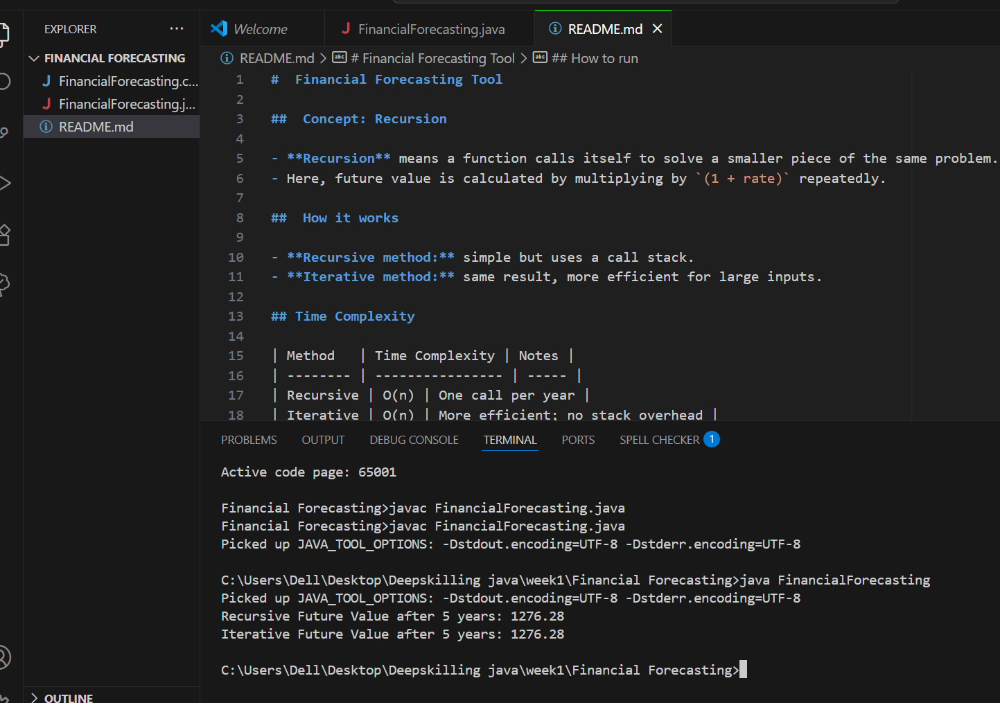

#  Financial Forecasting Tool

##  Concept: Recursion

- **Recursion** means a function calls itself to solve a smaller piece of the same problem.
- Here, future value is calculated by multiplying by `(1 + rate)` repeatedly.

##  How it works

- **Recursive method:** simple but uses a call stack.
- **Iterative method:** same result, more efficient for large inputs.

## Time Complexity

| Method   | Time Complexity | Notes |
| -------- | ---------------- | ----- |
| Recursive | O(n) | One call per year |
| Iterative | O(n) | More efficient; no stack overhead |

##  How to run

```bash
javac FinancialForecasting.java
java FinancialForecasting


## OUTPUT

