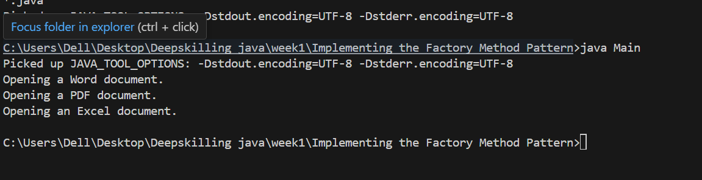

# Factory Method Pattern Example

##  Description
This project demonstrates the **Factory Method Pattern** by creating different types of documents (Word, PDF, Excel) in a document management system.
## Structure

FactoryMethodPatternExample/
 ├── src/
 │   └── documents/             <-- Package for Document types
 │        ├── Document.java
 │        ├── WordDocument.java
 │        ├── PdfDocument.java
 │        ├── ExcelDocument.java
 │
 │   └── factories/             <-- Package for Factory classes
 │        ├── DocumentFactory.java
 │        ├── WordDocumentFactory.java
 │        ├── PdfDocumentFactory.java
 │        ├── ExcelDocumentFactory.java
 │
 │   └── Main.java              <-- Test class
 │
 └── README.md                  <-- Project readme

##  How to Run
1. Compile all `.java` files:

## Output and verification

