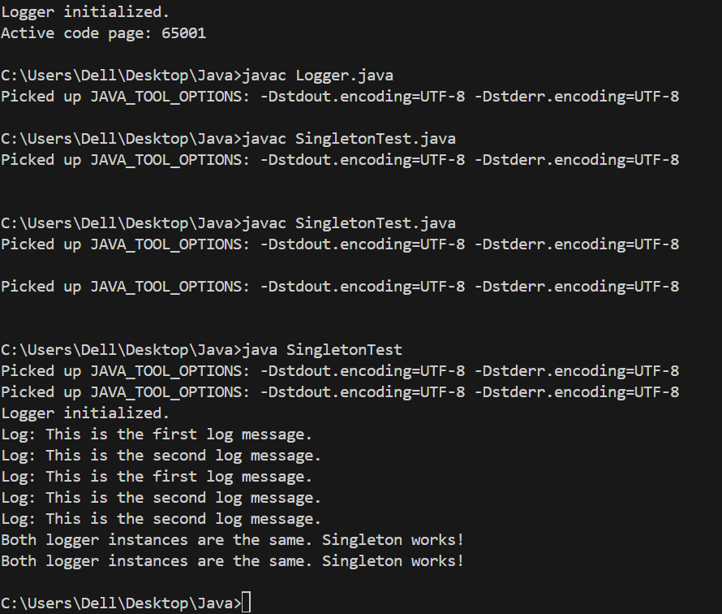

# SingletonPatternExample

# Objective
This project demonstrates the **Singleton Design Pattern** in Java, where a `Logger` class ensures that only one instance exists throughout the application to maintain consistent logging.

# Project Structure

SingletonPatternExample/
├── Logger.java             # Singleton class
├── SingletonTest.java      # Test class to verify Singleton
├── Logger.class            # Compiled class file
├── SingletonTest.class     # Compiled test file
├── output.png              # Screenshot of program output
└── README.md               # Documentation explaining the implementation

## STEP 1: Create the Singleton Class - Logger.java

public class Logger {
    private static Logger instance;

    private Logger() {
        System.out.println("Logger initialized.");
    }

    public static Logger getInstance() {
        if (instance == null) {
            instance = new Logger();
        }
        return instance;
    }

    public void log(String message) {
        System.out.println("Log: " + message);
    }
}

## STEP 2: Create the Test Class - SingletonTest.java
Calls Logger.getInstance() twice.
public class SingletonTest {
    public static void main(String[] args) {
        Logger logger1 = Logger.getInstance();
        logger1.log("This is the first log message.");

        Logger logger2 = Logger.getInstance();
        logger2.log("This is the second log message.");

        if (logger1 == logger2) {
            System.out.println("Both logger instances are the same. Singleton works!");
        } else {
            System.out.println("Logger instances are different. Singleton failed.");
        }
    }
}

## How to Run
javac Logger.java SingletonTest.java
java SingletonTest

## Output and Verification

Logger initialized.
Log: This is the first log message.
Log: This is the second log message.
Log: This is the first log message.
Log: This is the second log message.
Log: This is the second log message.
Both logger instances are the same. Singleton works!
Both logger instances are the same. Singleton works!
 