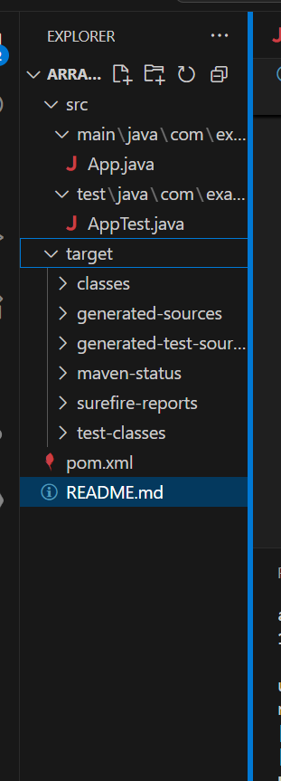

## Arrange-Act-Assert (AAA) Pattern, Test Fixtures, Setup and Teardown Methods in JUnit 
Scenario: 
You need to organize your tests using the Arrange-Act-Assert (AAA) pattern and use setup 
and teardown methods.

## Project Structure

## Setup
Java Version: OpenJDK 17 or above

Build Tool: Maven

Test Framework: JUnit 4.13.2

## pom.xml

<dependencies>
    <dependency>
        <groupId>junit</groupId>
        <artifactId>junit</artifactId>
        <version>4.13.2</version>
        <scope>test</scope>
    </dependency>
</dependencies>

## App.java
package com.example;

public class App {
    public int add(int a, int b) {
        return a + b;
    }

    public int subtract(int a, int b) {
        return a - b;
    }
}

## AppTest.java

package com.example;

import org.junit.After;
import org.junit.Before;
import org.junit.Test;
import static org.junit.Assert.*;

public class AppTest {

    private App app;

    @Before
    public void setUp() {
        // Arrange
        app = new App();
        System.out.println("Setup before each test");
    }

    @After
    public void tearDown() {
        System.out.println("Cleanup after each test");
    }

    @Test
    public void testAdd() {
        // Act
        int result = app.add(5, 3);

        // Assert
        assertEquals(8, result);
    }

    @Test
    public void testSubtract() {
        int result = app.subtract(10, 4);
        assertEquals(6, result);
    }
}

## Run the Tests

mvn clean install

## OUTPUT

