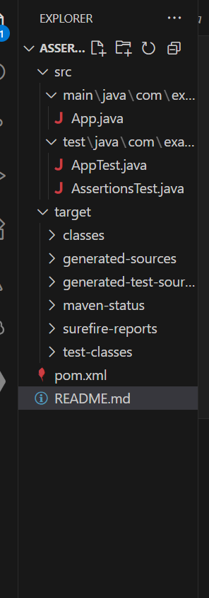
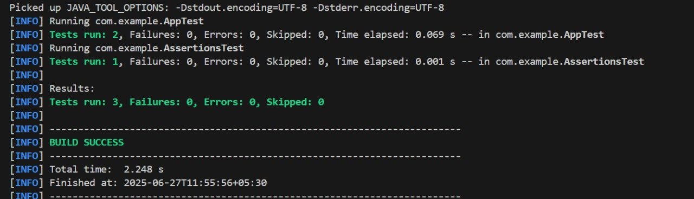

##  Assertions in JUnit 
Scenario: 
You need to use different assertions in JUnit to validate your test results.
## Project Structure

---

## Exercise Summary

| Exercise | Description                        | Status |
|----------|------------------------------------|--------|
| 1️     | Setup JUnit with Maven              |  Done |
| 2️   | Add and test `add()` & `subtract()` |  Done |
| 3️    | Use various JUnit assertions        |  Done |

##  Tech Stack

- Java 17+
- Maven
- JUnit 4.13.2

## Source Code

### App.java

package com.example;

public class App {
    public int add(int a, int b) {
        return a + b;
    }

    public int subtract(int a, int b) {
        return a - b;
    }

    public static void main(String[] args) {
        App app = new App();
        System.out.println("Sum: " + app.add(5, 3));
        System.out.println("Diff: " + app.subtract(10, 4));
    }
}

## AppTest.java
package com.example;

import static org.junit.Assert.assertEquals;
import org.junit.Test;

public class AppTest {

    @Test
    public void testAdd() {
        App app = new App();
        assertEquals(8, app.add(5, 3));
    }

    @Test
    public void testSubtract() {
        App app = new App();
        assertEquals(6, app.subtract(10, 4));
    }
}

##  AssertionsTest.java
package com.example;

import org.junit.Test;
import static org.junit.Assert.*;

public class AssertionsTest {

    @Test
    public void testAssertions() {
        // Assert equals
        assertEquals(5, 2 + 3);

        // Assert true
        assertTrue(5 > 3);

        // Assert false
        assertFalse(5 < 3);

        // Assert null
        assertNull(null);

        // Assert not null
        assertNotNull(new Object());
    }
}

## Running Tests

mvn test

## OUTPUT
