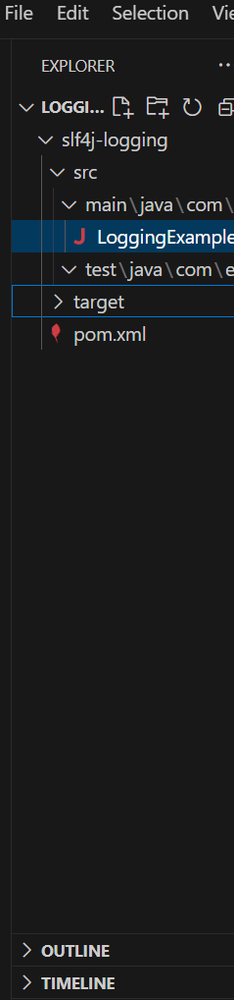
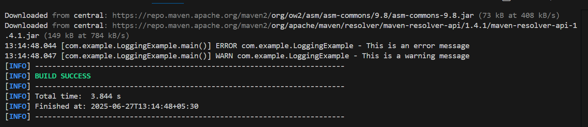

## Logging Error Messages and Warning Levels 
Task: Write a Java application that demonstrates logging error messages and warning levels 
using SLF4J.

## Project Structure

##  Dependencies

The project uses:

- `SLF4J` - Logging API
- `Logback` - SLF4J implementation

### `pom.xml` snippet:

    <dependencies>
        <!-- SLF4J API -->
        <dependency>
            <groupId>org.slf4j</groupId>
            <artifactId>slf4j-api</artifactId>
            <version>1.7.30</version>
        </dependency>

        <!-- Logback Classic (SLF4J implementation) -->
        <dependency>
            <groupId>ch.qos.logback</groupId>
            <artifactId>logback-classic</artifactId>
            <version>1.2.3</version>
        </dependency>
    </dependencies>

## LoggingExample
package com.example;

import org.slf4j.Logger;
import org.slf4j.LoggerFactory;

public class LoggingExample {
    private static final Logger logger = LoggerFactory.getLogger(LoggingExample.class);

    public static void main(String[] args) {
        logger.error("This is an error message");
        logger.warn("This is a warning message");
    }
}

## Run
mvn clean install

## Run the application
mvn exec:java -Dexec.mainClass="com.example.LoggingExample"

## OUTPUT

