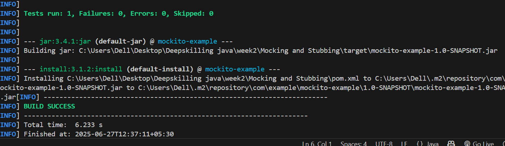

# Exercise 1: Mocking and Stubbing with Mockito

##  Objective

To test a service that depends on an external API by using **Mockito** to:
- Create a mock object
- Stub method behavior
- Verify results using assertions

##  Project Structure

##  Technologies Used

- Java 17
- JUnit 4.13.2
- Mockito 5.12.0
- Maven

---

## Maven Dependencies (`pom.xml`)

<dependencies>
        <!-- JUnit 5 -->
        <dependency>
            <groupId>org.junit.jupiter</groupId>
            <artifactId>junit-jupiter</artifactId>
            <version>5.10.2</version>
            <scope>test</scope>
        </dependency>

        <!-- Mockito -->
        <dependency>
            <groupId>org.mockito</groupId>
            <artifactId>mockito-core</artifactId>
            <version>5.12.0</version>
            <scope>test</scope>
        </dependency>
    </dependencies>

## ExternalApi.java
package com.example;

public interface ExternalApi {
    String getData();
}

## MyService.java

package com.example;

public class MyService {
    private ExternalApi api;

    public MyService(ExternalApi api) {
        this.api = api;
    }

    public String fetchData() {
        return api.getData();
    }
}

## MyServiceTest.java

package com.example;

import static org.junit.jupiter.api.Assertions.assertEquals;
import static org.mockito.Mockito.*;

import org.junit.jupiter.api.Test;

public class MyServiceTest {

    @Test
    public void testExternalApi() {
        ExternalApi mockApi = mock(ExternalApi.class);
        when(mockApi.getData()).thenReturn("Mock Data");

        MyService service = new MyService(mockApi);
        String result = service.fetchData();

        assertEquals("Mock Data", result);
    }
}

## Run
mvn clean install

## Output

