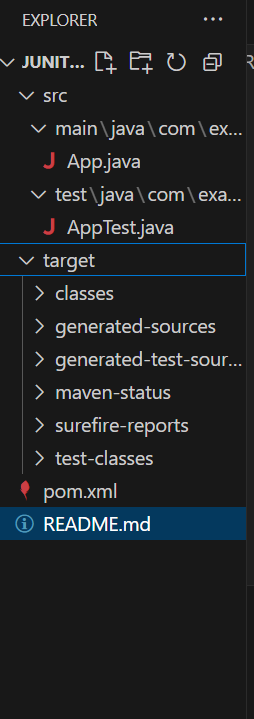
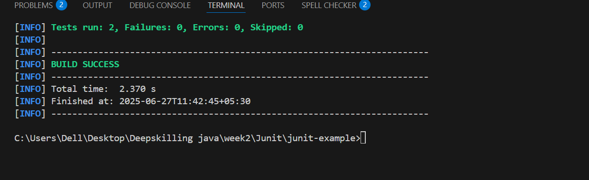

# JUnit Example with Maven

This is a simple Java project that demonstrates how to set up and run unit tests using **JUnit 4** and **Maven**.

## Project Structure

## What This Project Does

 Implements a simple Java class with two methods:
  `add(int a, int b)`
 `subtract(int a, int b)`
 Uses **JUnit 4** to test these methods
 Runs the tests using Maven

##  Technologies Used

- Java 17+
- JUnit 4.13.2
- Maven

##  How to Run

1. Clone the repository or create the folder structure manually.
2. Make sure Java and Maven are installed:
   bash
   java -version
   mvn -version

## App.java
package com.example;

public class App {
    public int add(int a, int b) {
        return a + b;
    }

    public int subtract(int a, int b) {
        return a - b;
    }

    public static void main(String[] args) {
        App app = new App();
        System.out.println("Sum: " + app.add(5, 3));
        System.out.println("Diff: " + app.subtract(10, 4));
    }
}

## AppTest.java

package com.example;

import static org.junit.Assert.assertEquals;
import org.junit.Test;

public class AppTest {

    @Test
    public void testAdd() {
        App app = new App();
        assertEquals(8, app.add(5, 3));
    }

    @Test
    public void testSubtract() {
        App app = new App();
        assertEquals(6, app.subtract(10, 4));
    }
}

## To build and test:
mvn clean install
mvn test

## Output
