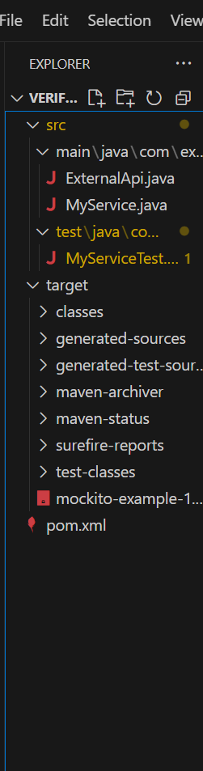
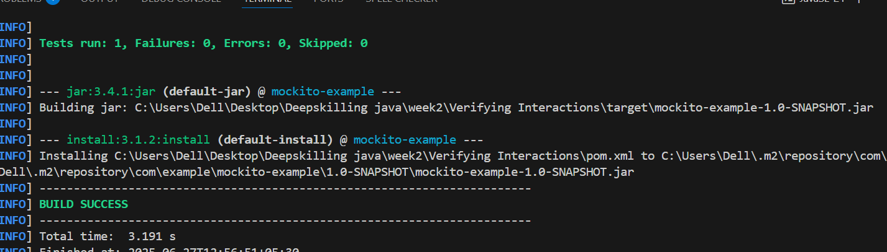

##  Verifying Interactions 
Scenario: 
You need to ensure that a method is called with specific arguments.

## Project Structure:

## pom.xml
<dependencies>
  
    <dependency>
        <groupId>junit</groupId>
        <artifactId>junit</artifactId>
        <version>4.13.2</version>
        <scope>test</scope>
    </dependency>

    
    <dependency>
        <groupId>org.mockito</groupId>
        <artifactId>mockito-core</artifactId>
        <version>5.12.0</version>
        <scope>test</scope>
    </dependency>
</dependencies>

## ExternalApi.java
package com.example;

public interface ExternalApi {
    String getData();
}
## MyService.java

package com.example;

public class MyService {
    private ExternalApi api;

    public MyService(ExternalApi api) {
        this.api = api;
    }

    public String fetchData() {
        return api.getData();  // Real or mock call
    }
}
## MyServiceTest.java
package com.example;

import static org.mockito.Mockito.*;
import static org.junit.Assert.*;

import org.junit.Test;
import org.mockito.Mockito;

public class MyServiceTest {

    @Test
    public void testVerifyInteraction() {
        // Step 1: Create a mock
        ExternalApi mockApi = Mockito.mock(ExternalApi.class);

        // Step 2: Inject mock into service
        MyService service = new MyService(mockApi);

        // Step 3: Call the method
        service.fetchData();

        // Step 4: Verify the method was called
        verify(mockApi).getData();
    }
}
## Run the Test:
mvn clean install
mvn test

## output
